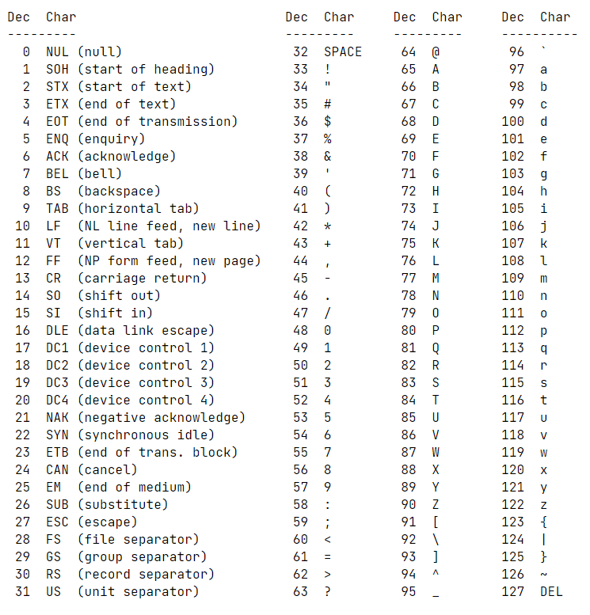

# Libft

To remove `.o` files, do `make clean`.

## Libc Functions

- ft_isalpha
- ft_isdigit
- ft_isalnum
- ft_isascii
- ft_isprint
- ft_strlen
- ft_memset
- ft_bzero
- ft_memcpy
- ft_memmove
- ft_strlcpy //
- ft_strlcat //
- ft_toupper
- ft_tolower
- ft_strchr
- ft_strrchr
- ft_strncmp
- ft_memchr
- ft_memcmp
- ft_strnstr //
- ft_atoi
- ft_calloc
- ft_strdup

### Docs

- https://www.geeksforgeeks.org/size_t-data-type-c-language/
- https://www.geeksforgeeks.org/c-typecasting/
- https://cs50.stackexchange.com/questions/14615/memory-overlap-in-c
- https://opensource.apple.com/source/Libc/Libc-997.1.1/string/strlcat.c.auto.html
- https://opensource.apple.com/source/xnu/xnu-4570.1.46/osfmk/arm/strlcpy.c.auto.html
- https://opensource.apple.com/source/Libc/Libc-1158.30.7/string/FreeBSD/strnstr.c.auto.html

## Additional Functions

- ft_substr
- ft_strjoin
- ft_strtrim
- ft_split
- ft_itoa
- ft_strmapi
- ft_striteri
- ft_putchar_fd
- ft_putstr_fd
- ft_putendl_fd
- ft_putnbr_fd
